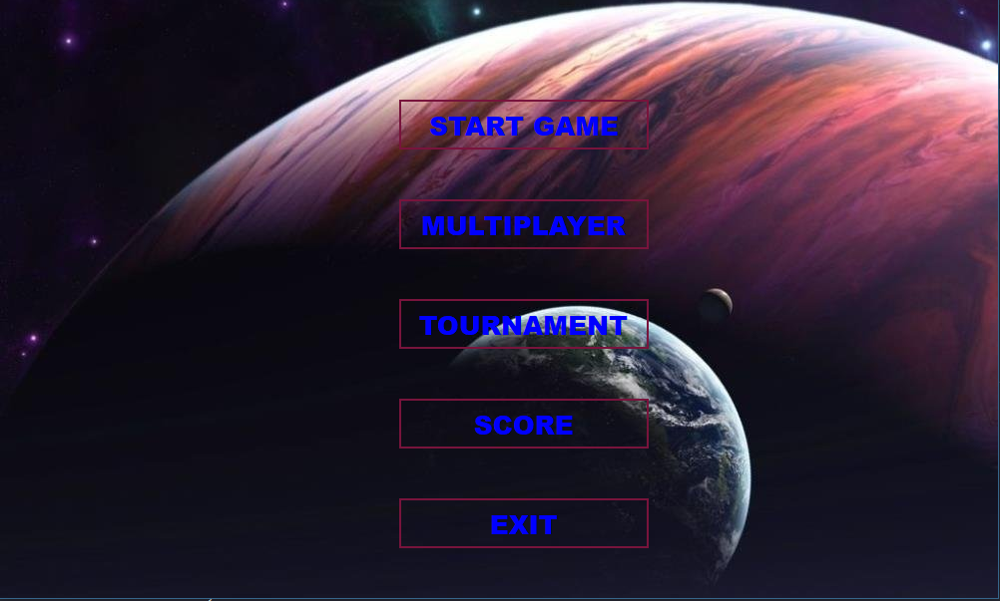
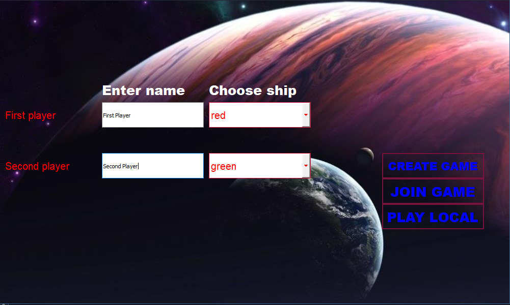
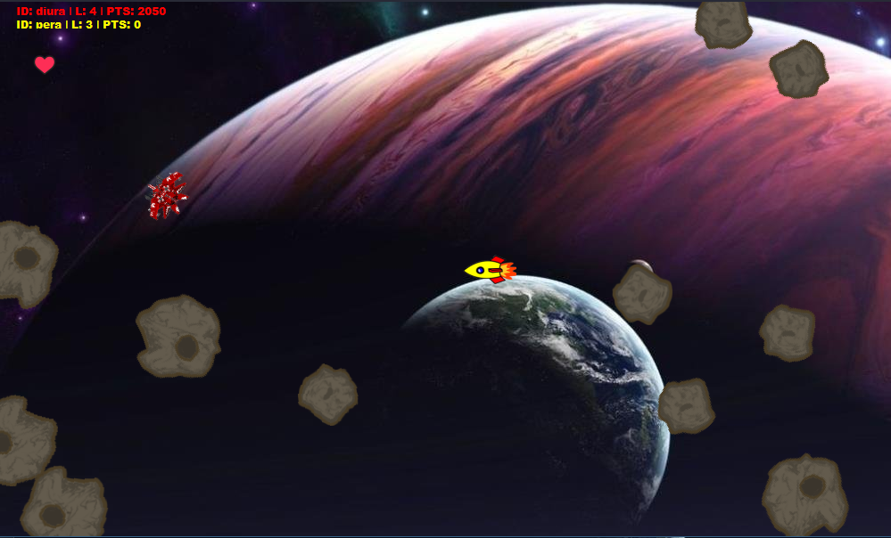
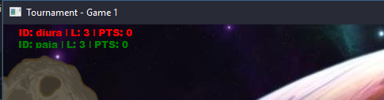
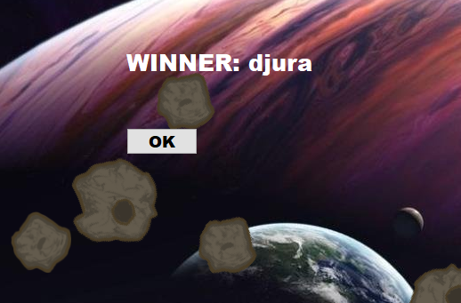

# Drs_Asteroids

School project for a Distributed Computer System class in Faculty of Technical Sciences - Novi Sad. The goal is to recreate Asteroids game using PyQt5.

## Table of Contents

- [Getting Started](#Getting-Started)
  - [Prerequisites](#Prerequisites)
  - [Setup](#Setup)
- [Usage Guide](#Usage-Guide)
  - [Menu](#Menu)
  - [Key Bindings](#Key-Bindings)
  - [Game Rules](#Game-Rules)

---

## Getting Started

Use these instructions to get the project up and running.

### Prerequisites

You will need the following tools:

- [PyCharm](https://www.jetbrains.com/pycharm/)
- [Python3](https://www.python.org/)
- [PyQt5](https://pypi.org/project/PyQt5/)

### Setup

Follow these steps to get your development environment set up:

1. Open project in `PyCharm`
1. Run `__main__.py` as start project

---

## Usage Guide

This section will focus on how to use this application, as well as give brief explanation on what each display does.

### Menu

Once you start application you are greeted with starting menu.

From here you have option to start singleplayer game, multiplayer, tournament, to see high scores or to exit game.

All of the buttons (except `Score`) lead you to "settings" page from which you can chose your username and ship.

### Key Bindings

Local multiplayer has following key bindings:

| Action | Player1 | Player2 |
| :--- | :---: | ---: |
| **Shoot**  | `Spacebar`  | `Ctrl`|
| **Accelerate** | `Up-Arrow` | `W` |
| **Deccelerate** | `Down-Arrow` | `S` |
| **Rotate Left** | `Left-Arrow` | `A` |
| **Rotate Right** | `Right-Arrow` | `D` |

### Game Rules

At the start of the game two players spawn at the center and asteroids are going towards them. 

As they destroy asteroids they gain points which is displayed at the upper-left corner of the screen, as well as the name of the game (ex. "Game 1", "Game 2" or "Finale" in case of Tournament)

Once both players are dead, the winner is the one who earned most points and his name is displayed on screen, with `Ok` button.

> In case of tournament clicking on `Ok` button will start next game in tournament

#### Additional rules

- Destroying asteroid will split it into two smaller parts (100 points for biggest, 150 for medium, and 200 for smallest)
- At the start of new level all players that are alive will get 1000 points as reward
- Players cannot hit each other
- Upon hitting an asteroid players spaceship will _"grey out"_ for few seconds. During this time he will be invulnerable and he won't be able to shoot bullets.